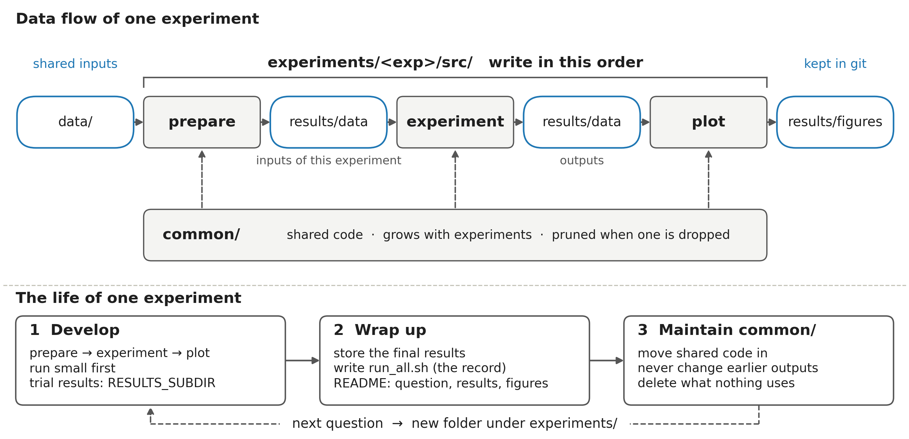

# experiments-template

A folder layout for a research project with several experiments that share code and data. Copy it, rename
`experiments/example_experiment/`, and fill in the three stages.

```
common/                 code shared by every experiment
data/                   inputs shared by every experiment
experiments/<exp>/
├── run_all.sh          the whole pipeline in order: prepare -> experiment -> plot
├── README.md           question, setup, results (tables + figures), notes, how to run
├── src/
│   ├── prepare/        builds the inputs of this experiment
│   ├── experiment/     runs the experiment
│   └── plot/           draws the figures
└── results/
    ├── data/           inputs and outputs of each run (git-ignored)
    └── figures/        figures embedded in the READMEs (tracked)
```

## Workflow

Data flows one way, and the code is written in the same order:



1. `prepare`: turn the shared inputs in `data/` into this experiment's inputs under `results/data/`.
2. `experiment`: read those inputs, run the experiment, write the outputs under `results/data/`.
3. `plot`: read the outputs, write the figures under `results/figures/`.

Each stage reads only what the previous stage wrote, so any stage can be re-run on its own. An experiment is
developed with trial results kept apart (`RESULTS_SUBDIR`), then wrapped up: the final results are stored,
`run_all.sh` is written as the record of the final run, and the README gets the results. What the next experiment
also needs moves into `common/`, which is pruned whenever an experiment is dropped.

- Run everything from the project root as modules: `.venv/bin/python -m experiments.<exp>.src.<stage>.<script>`.
- `run_all.sh` is the executable record of how the experiment was run.
- `RESULTS_SUBDIR=<name>` makes every script read and write under `results/<name>/`, so a re-run never touches the
  stored results.
- `CLAUDE.md` holds the working rules: layout, code style, running experiments, reproducibility, documentation.
